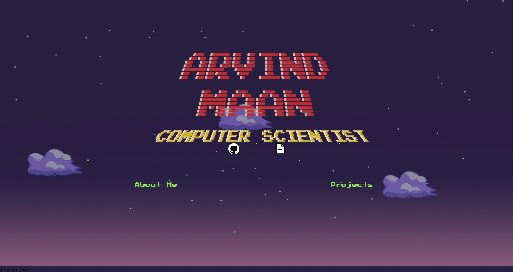

ArvindMaan.dev
---
For my website, since this is one my earliest attempt at web development, you can see my previous drafts that it took to get where I am. (Descending order, newest first)

Current Draft: 

 

(September 2019)
This is the current iteration of my website, built with Jekyll, Liquid and SASS.
The previous iteration of my website was a step in the right direction but I found it to be too plain. I took parts from it I did enjoy, like the centerpiece avatar, and pulled in new elements to make it a little less boring. The background was created from a picture I took from Vancouver, BC with a black and white filter and CSS gradient applied over top.

Third Draft: 

 

(September 2019)
After some time, I found that I wasn't very impressed with my design on the previous website and wished to create a more simple, but more sleek design. The 3rd draft of my website is made using Jekyll and in my opinion, looks much nicer than the previous iteration. The design is complimented by a simple pulse animation on the middle icon. 

 

(April 2019)
The second draft has a scrolling feature which infinitely scrolls through the above background to give kind of a platformer background feel.
This implementation was meant for me to become more comfortable with the use of flexbox and cs animations. In my next draft I intend to work more on the animations and perhaps recreating a more professional looking website.

First Draft: 

(March 2019)
While not bad, I wasn't very satisfied with the layout of the images as I didn't use grid or flexbox, which resulted in it not translating well over different browser sizes. Also, I wanted to learn more about animation in css so I plan for the next draft to be laid out better as well as have some more interesting animations than the flashing texts.

Second Draft:
