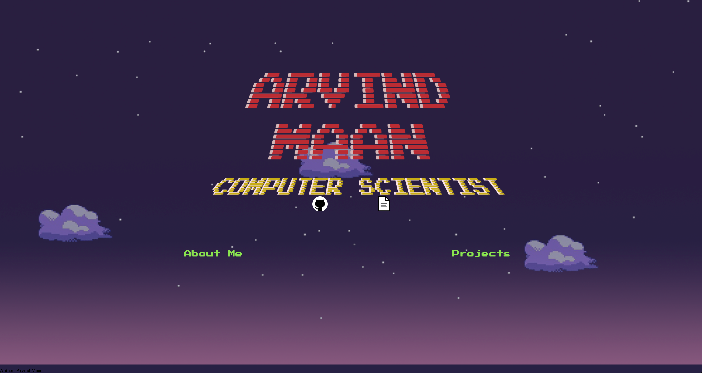
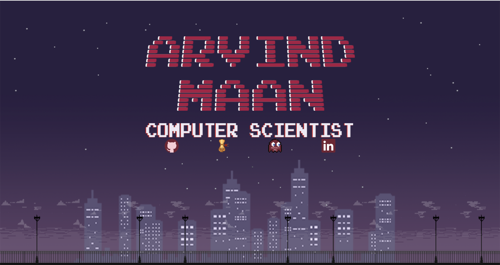

ArvindMaan.dev
---

First Draft: 

(March 2019)
While not bad, I wasn't very satisfied with the layout of the images as I didn't use grid or flexbox, which resulted in it not translating well over different browser sizes. Also, I wanted to learn more about animation in css so I plan for the next draft to be laid out better as well as have some more interesting animations than the flashing texts.

Second Draft:

 

(April 2019)
The second draft has a scrolling feature which infinitely scrolls through the above background to give kind of a platformer background feel.
This implementation was meant for me to become more comfortable with the use of flexbox and cs animations. In my next draft I intend to work more on the animations and perhaps recreating a more professional looking website.
